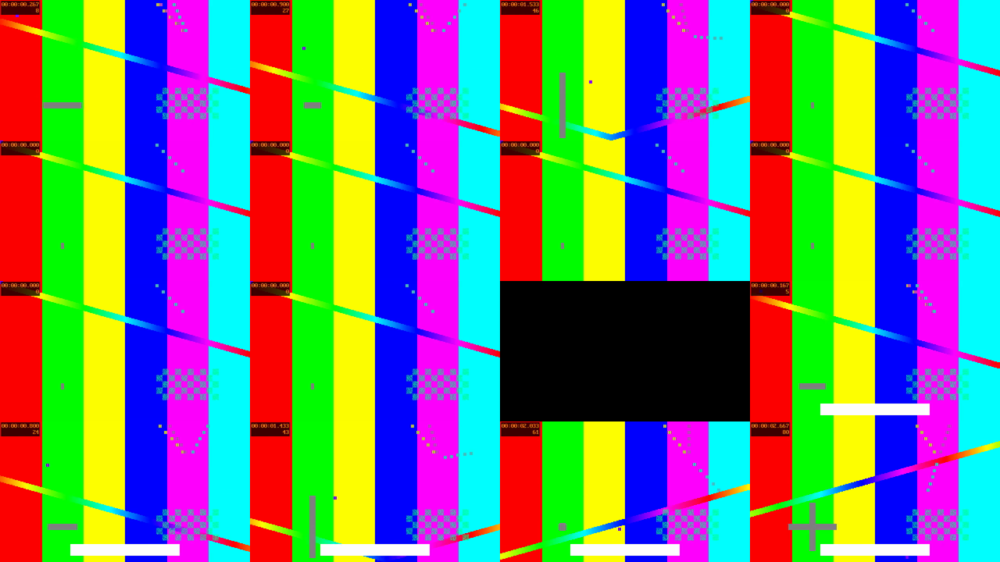

# vidlint

**ESLint for the rendered frame.** Point it at a video file and get back a
deterministic, machine-readable defect report: blank frames, a picture that
froze while the audio kept playing, dead air, photosensitivity hazards, silent
or clipped audio, and container problems — each with a timecode, the numbers
that triggered it, and a suggested fix.

No dependencies. No rendering. No vision model. It uses the `ffmpeg` you already
have.

```
✖ 0:02.07–0:06.03   frozen-with-audio
    Picture frozen while audio continues
    The frame does not change for 3.97s (0:02.07 to 0:06.03),
    while audio is playing for 99% of that time.
```

---

## The problem this exists to solve

An agent (or a person) renders a video, sees exit code 0, and declares it done.
Rendering proves the pipeline ran. It proves nothing about the result.

The dominant failure modes are invisible at render time and obvious to a viewer:

- A scene's animation ends at 3s but its voiceover runs to 8s. Five seconds of
  frozen picture under a talking narrator.
- A `<Sequence>` covers fewer frames than the composition duration. Black gap.
- The mix lands at -40 LUFS and is inaudible on a phone.
- A hard cut between black and white frames, repeated, crosses the
  photosensitivity threshold.

None of these are catchable by reading the source. You have to measure the
output.

## The differentiator: joining the picture to the audio

`freezedetect` and `silencedetect` each see half the story. A frozen frame means
two completely different things depending on what you can hear:

| Picture | Audio | What it actually is | vidlint says |
| --- | --- | --- | --- |
| frozen | talking | a stalled render | **error** |
| frozen | silent | a deliberate held beat | info |

vidlint computes that join. As far as I can tell, no other tool does — it is the
reason this project exists rather than being a shell script around `ffmpeg`.

## Install

Requires Node 18+ and `ffmpeg`/`ffprobe` on `PATH`. There are no npm
dependencies; vidlint bundles no binaries.

```bash
git clone https://github.com/ai2922/vidlint.git
cd vidlint
node bin/vidlint.mjs --help
```

Make it available everywhere:

```bash
npm link          # then: vidlint <file>
```

`ffmpeg` install, if you need it:

```bash
winget install Gyan.FFmpeg     # Windows
brew install ffmpeg            # macOS
sudo apt install ffmpeg        # Debian/Ubuntu
```

Override the binaries with `VIDLINT_FFMPEG` and `VIDLINT_FFPROBE` if they live
somewhere unusual.

> **Status:** not yet published to npm. The `npx vidlint` form works once it is.

## Quick start

```bash
vidlint out.mp4                       # human-readable report
vidlint out.mp4 --verbose             # include info-level findings
vidlint out.mp4 --json                # machine-readable, for a fix loop
vidlint out.mp4 --strict              # fail on warnings too (for CI)
vidlint out.mp4 --platform reels      # also check platform safe areas
vidlint out.mp4 --html report.html    # self-contained report with sampled frames
vidlint out.mp4 --sheet sheet.png     # contact sheet of the whole timeline
```

Exit codes: `0` clean, `1` defects found, `2` usage or analysis error.

## Example output

Real output, from the deliberately-broken test fixture in this repo
(`test/helpers/fixtures.mjs` plants a frozen-with-audio segment, a black second,
and a banner inside the bottom safe area):

```
vidlint 0.1.0  bad.mp4
  640×360 · 30.00 fps · 10.02s · 650 kB · h264
  audio: aac · 44100 Hz · 1 ch

  ✖ 2 errors · ⚠ 0 warnings · ℹ 0 info

  ✖ 0:02.07–0:06.03   frozen-with-audio
      Picture frozen while audio continues
      The frame does not change for 3.97s (0:02.07 to 0:06.03), while audio
      is playing for 99% of that time.
      ↳ This is the signature of a stalled render or a missing animation...

  ✖ 0:06.03–0:07.03   blank-frames
      Blank frames
      1.00s of black frames at 0:06.03.
      ↳ A blank stretch usually means a scene rendered empty...

  dead air 50% · 2 cuts · longest static 4.0s · -14.0 LUFS · peak -6.9 dBFS
```

The contact sheet makes it obvious at a glance — eight identical tiles are the
frozen stretch, with the black frame in the middle:



There is a full generated HTML report at
[`docs/example-report.html`](docs/example-report.html) — open it to see the
defect timeline and the sampled frames inline.

## What it checks

Deterministic checks, always on:

| Rule | Default | What it means |
| --- | --- | --- |
| `blank-frames` | error | The frame is one flat colour; nothing is rendering. |
| `frozen-with-audio` | error | The picture froze while audio continued. |
| `dead-air` | warn | A static stretch, graded against the audio track. |
| `flash-risk` | error | Above the photosensitivity threshold. |
| `mostly-static` | warn | Over 60% of the runtime has almost no movement. |
| `no-cuts` | info | No scene change across 20s or more. |
| `silent-audio-track` | error | The audio stream carries nothing. |
| `no-audio-track` | warn | The file has no audio at all. |
| `audio-gap` | warn/info | A long silent stretch under moving picture. |
| `too-quiet` / `too-loud` | warn | Integrated loudness outside the delivery window. |
| `audio-clipping` | warn/error | True peak at or over the ceiling. |
| `low-frame-rate` | warn | Below the frame-rate floor. |
| `very-short` | warn | Below the duration floor. |
| `rotation-metadata` | warn | The video depends on a rotation flag players may ignore. |
| `over-compressed` | warn | Very low bits per pixel per frame. |
| `unusual-codec` | info | Likely to be transcoded badly on upload. |

Pixel heuristics, **opt-in** because they can false-positive on busy full-bleed
footage:

| Rule | Enabled by | What it means |
| --- | --- | --- |
| `safe-area` | `--platform <name>` | A distinct element sits where platform chrome will cover it. |
| `edge-clipping` | `--layout` | Structure in the outermost sliver of the frame. |

Run `vidlint --list-rules` (or the MCP `list_rules` tool) for the full catalogue.

## The agent loop

This is the intended use. `vidlint` ships an Agent Skill
([`skills/vidlint/SKILL.md`](skills/vidlint/SKILL.md)) that installs the
discipline:

1. Render the video.
2. `vidlint out.mp4 --verbose`
3. Fix every **error**, then go back to step 1.
4. Decide deliberately about each warning. Do not silently ignore them.
5. Only then report the video as done — with the final counts as evidence.

Each defect carries a stable `fingerprint` (`frozen-with-audio@2.1`) so an agent
can tell "the same problem, still there" from "a new problem" across iterations.

Copy the skill into your agent's skill directory:

```bash
cp -r skills/vidlint ~/.claude/skills/       # or wherever your agent reads skills
```

## MCP server

MCP is a **thin adapter** here, not the primary interface. (Remotion deprecated
their own official MCP server in favour of Skills, noting that agents do not
invoke MCP tools reliably. The CLI plus a Skill is the more dependable path.)

It is dependency-free — MCP's stdio transport is newline-delimited JSON-RPC, so
there was no reason to pull in an SDK.

```jsonc
// e.g. Claude Desktop / Cursor config
{
  "mcpServers": {
    "vidlint": { "command": "npx", "args": ["-y", "vidlint-mcp"] }
  }
}
```

Tools: `lint_video`, `list_rules`, `list_platforms`.

## Programmatic API

```js
import { lint, renderText, renderHtml } from "vidlint";

const report = await lint("out.mp4", { platform: "reels" });

console.log(report.summary);        // { total, errors, warnings, infos, passed }
console.log(report.defects[0]);     // { id, fingerprint, severity, from, to, evidence, hint }

if (!report.summary.passed) process.exit(1);
```

The JSON report is versioned (`schemaVersion`) — see
[`schema/report.schema.json`](schema/report.schema.json).

## Honest limitations

**vidlint cannot see your DOM, so it cannot catch the defects most likely to
make a generated video look wrong.** It cannot tell you that a headline
overflows its container, that two elements collide, or that text is rendered at
14px on a 1080p frame. It analyses pixels and audio, and a pixel heuristic
cannot recover that information reliably.

A clean report means **the video is not broken**. It does not mean the video is
well composed. Please do not present it as proof of quality.

For the layout class of bugs, use Remotion's first-party tooling at author time —
`measureText()`, `fillTextBox()` (which returns `exceedsBox`), and `fitText()`.
Two traps make those lie: measuring before web fonts load, and using `border`
instead of `outline` (border changes layout). Overflow is also aspect-ratio
dependent — the source that overflows at 1080×1920 is character-for-character
the source that fits at 1920×1080, so you must check every format you ship.

Other deliberate limits:

- **The safe-area presets are not authoritative.** Neither TikTok, Meta nor
  Google publishes an official safe-area pixel table. Only the `remotion` preset
  derives from a first-party source (Remotion's own 80px/100px layout rule). The
  per-platform presets are community-reported. Calibrate on a real device, or
  pass `--safe-area` with your own numbers.
- **The layout heuristics false-positive on busy full-bleed footage.** That is
  why they are opt-in. They are tuned for composed video with flat backgrounds.
- **Flash detection is a faithful but not certified implementation** of the
  WCAG general-flash threshold. It approximates the 10° visual field with a 3×3
  grid of the frame. It does not implement the red-flash or spatial-pattern
  tests of ITU-R BT.1702 / EBU QC 0021B.
- **Only general software/GUI media.** No HDR luminance path, no audio-described
  or captions analysis, no per-codec quality scoring.
- **Not a pixel-diff tool.** It has no baseline and does not compare two videos.
  If you want regression diffing, use `pixelmatch` or `odiff`.

## How this relates to existing tools

Nothing here is invented in a vacuum, and the space is not empty:

- **`ffmpeg` detectors** (`freezedetect`, `silencedetect`, `blackdetect`,
  `ebur128`) are the substrate. They emit unstructured stderr text with no rule
  taxonomy, and they cannot express the audio-visual join. vidlint reads raw
  frames instead of parsing detector output, which is what makes the join and
  the unified report possible.
- **`overflowlint`** is an excellent DOM layout linter, but it has no notion of
  time, frames, audio, or an MP4.
- **Narro** covers a similar rule set but is a whole replacement framework with
  its own runtime; it is not usable on an existing Remotion project.
- **`pixelmatch` / `odiff`** answer "did it change", never "is it wrong", and
  need a baseline — which a first AI draft does not have.
- **`mcp-ffmpeg`** and friends expose raw capability with zero judgement.

The unoccupied position vidlint tries to hold: framework-agnostic, MP4-first,
deterministic, baseline-free, and shaped like something an agent can iterate
against.

## Standards referenced

- **WCAG 2.3.1** *Three Flashes or Below Threshold* — more than three flashes in
  any one-second period; a general flash is a pair of opposing changes in
  relative luminance of 10% or more where the darker image is below 0.80, over
  at least 25% of a 10° visual field.
- **ITU-R BT.1702** and **EBU QC 0021B** ("Flashing Video", the Harding test) —
  the broadcast equivalents.
- **EBU R128** — the loudness measurement. The default -14 LUFS target is the
  common social/web delivery level, not an EBU broadcast figure (R128 broadcast
  is -23 LUFS); both are configurable.
- **Remotion's layout rule** — at 1080px wide, keep key content ≥80px from the
  sides and ≥100px from top/bottom; headline ≥84px, supporting text ≥44px.

## Development

```bash
npm test                          # everything
node --test "test/*.test.mjs"     # same thing without npm
node --test test/unit.test.mjs    # pure functions, no ffmpeg needed
```

> Note: pass a glob or an explicit file list. `node --test test/` tries to load
> the directory as a module on Node 22 and fails.

The test suite generates its own fixtures with `ffmpeg` on first run — nothing
binary is committed. `bad.mp4` plants known defects so the checks are verified
against ground truth rather than against themselves; `clean-bg.mp4` is the
realistic composed-video case that must come back clean.

Repository conventions: source files are **ASCII-only** (editing them with
PowerShell's `Set-Content` round-trips them through the ANSI codepage and
silently corrupts multi-byte characters), and vidlint itself takes **no runtime
dependencies**.

## License

MIT — see [LICENSE](LICENSE).
